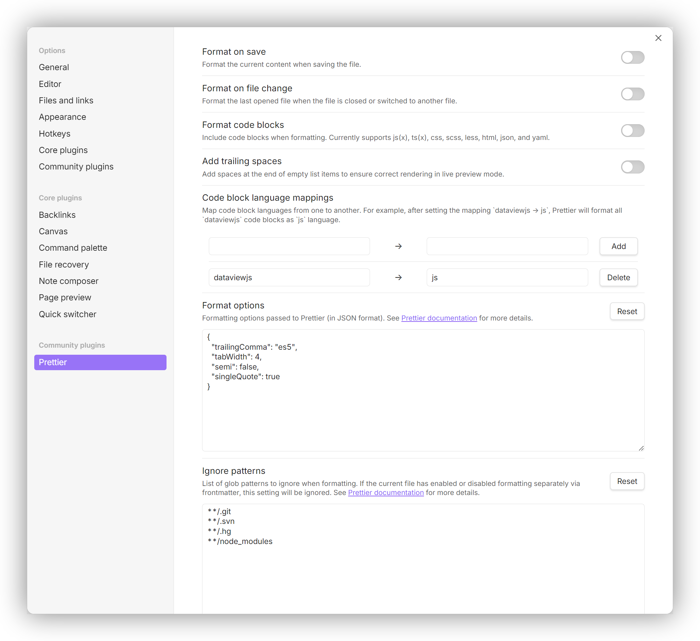

# obsidian-plugin-prettier

 

This is an [Obsidian](https://obsidian.md) plugin that uses [Prettier](https://prettier.io) to format notes.

The main inspiration comes from https://github.com/hipstersmoothie/obsidian-plugin-prettier. Since that repository is not actively maintained and does not declare an open source license, I have re-implemented its features and added some new features.



## Features

- Multi language support, currently available in Simplified Chinese and English.
- Supports Markdown and MDX formats.
- Format the entire content or only the selected content.
- Format embedded code blocks. Currently supports js(x), ts(x), css, scss, less, html, json, and yaml.
- Supports remapping the language of the code block to another.
- Optionally add trailing spaces that are removed after formatting. This ensures correct rendering in live preview mode.

    Example:

    ```text
    -
    -␣[ ]
    ```

    Formatted:

    ```text
    -␣
    -␣[ ]␣
    ```

- Supports enabling or disabling formatting for the current file separately in frontmatter. Enabled by default when not set.

    Example:

    ```yaml
    ---
    prettier: false
    ---
    ```

- Supports enabling or disabling fast mode formatting for the current file separately in frontmatter. Disabled by default when not set.

    Example:

    ```yaml
    ---
    prettier-fast-mode: false
    ---
    ```

## Commands and Menus

- Format all content

    ID: `format-content`

    Hotkey: `None` (default)

- Format selected content

    ID: `format-selection`

    Hotkey: `None` (default)

    Only available when some content is selected.

## Settings

- Format on save

    Default: `false`

    Format the current content when saving the file.

- Format on file change

    Default: `false`

    Format the last opened file when the file is closed or switched to another file.

- Format code blocks

    Default: `false`

    Include code blocks when formatting. Currently supports js(x), ts(x), css, scss, less, html, json, and yaml.

- Add trailing spaces

    Default: `false`

    Add spaces at the end of empty list items to ensure correct rendering in live preview mode.

- Code block language mappings

    Default: `None`

    Map code block languages from one to another. For example, after setting the mapping `dataviewjs → js`, Prettier will format all `dataviewjs` code blocks as `js` language.

- Format options

    Default:

    ```json
    {
        "trailingComma": "es5",
        "tabWidth": 4,
        "semi": false,
        "singleQuote": true
    }
    ```

    Formatting options passed to Prettier (in JSON format).

- Ignore patterns

    Default:

    ```text
    **/.git
    **/.svn
    **/.hg
    **/node_modules
    ```

    File patterns to ignore (relative to the vault directory).

## Change Log

See [CHANGELOG.md](./CHANGELOG.md).

## Development

1.  Install dependencies:

    ```bash
    pnpm install
    ```

2.  Build the plugin:

    ```bash
    pnpm build
    ```

    The built files will be located in the `dist` directory.

3.  Copy the built files to your Obsidian vault's plugins directory (e.g., `/path/to/Vault/.obsidian/plugins/prettier-dev`).

4.  Load the plugin in Obsidian.

5.  You can also use the following command to watch for file changes and automatically rebuild:

    ```bash
    pnpm dev
    ```

### Optional: Link plugin directory for easier development

To avoid manually copying files each time, you can create a symbolic link from your Obsidian vault's plugin directory to the `dist` directory in this repository.

On Linux/macOS:

```bash
ln -s /path/to/Vault/.obsidian/plugins/prettier-dev dist
```

On Windows (using Command Prompt as Administrator):

```cmd
mklink /D "dist" "C:\path\to\Vault\.obsidian\plugins\prettier-dev"
```

On Windows (using PowerShell as Administrator):

```powershell
New-Item -ItemType SymbolicLink -Path "dist" -Target "C:\path\to\Vault\.obsidian\plugins\prettier-dev"
```

With this setup and the [Hot Reload](https://github.com/pjeby/hot-reload) plugin installed in Obsidian, the plugin will automatically reload when files are changed and rebuilt.

## License

MIT
